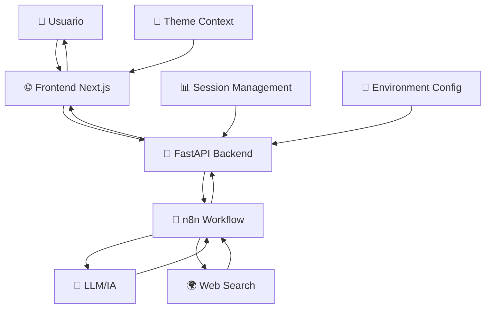

# 🤖 Jarvis - Asistente de Investigación Inteligente

<div align="center">


**Un asistente de investigación inteligente que combina frontend moderno, backend robusto y workflows de IA**

[🚀 Inicio Rápido](#-inicio-rápido) • 
[📖 Documentación](#-documentación) • 
[🛠️ Características](#-características-principales) • 
[📸 Screenshots](#-screenshots)

</div>

---

## 👨‍💻 Autor

**Antonio Jesús Padilla**
- 🎯 **Proyecto Completo**: Diseño, arquitectura, desarrollo frontend, backend, integración y documentación
- 📧 **Contacto**: [Tu email/perfil]
- 🌐 **Portfolio**: [Tu portfolio/GitHub]

---

## 🌟 Características Principales

### 🎨 **Frontend Moderno**
- ✨ Interfaz de chat intuitiva y responsive con **Next.js 15**
- 🌓 **Toggle de tema oscuro/claro** personalizable [[memory:5740580]]
- 📱 Diseño completamente **responsive** (móvil, tablet, escritorio)
- ⚡ **Gestión de estado** con Context API y TypeScript
- 🔄 **Tiempo real** con indicadores de carga y estados

### 🚀 **Backend Robusto**
- 🐍 **FastAPI** con documentación automática
- 🔒 **CORS configurado** para desarrollo seguro
- 🔄 **Gestión de sesiones** con sessionId único
- 🧪 **Endpoints de testing** para desarrollo
- 📝 **Validación de datos** con Pydantic

### 🤖 **Integración de IA**
- 🌐 **n8n workflows** para procesamiento inteligente
- 🔍 **Investigación web automatizada** con resúmenes de IA
- 💬 **Conversaciones contextuales** manteniendo historial
- 🎯 **Respuestas especializadas** según el tipo de consulta

### 🔧 **DevOps y Calidad**
- 🐳 **Docker & Docker Compose** para despliegue
- 📜 **Scripts automatizados** de inicio/parada
- 🔒 **Variables de entorno** seguras [[memory:5860451]]
- 📁 **Estructura organizada** de proyecto [[memory:6741209]]

---

## 🚀 Inicio Rápido

### ⚡ Método Automático (Recomendado)

```powershell
# 1. Clonar el repositorio
git clone https://github.com/[tu-usuario]/jarvis.git
cd jarvis

# 2. Configurar variables de entorno
copy config.env.example .env
# Editar .env con tus configuraciones

# 3. Ejecutar Jarvis completo
.\start_jarvis.ps1
```

**¡Listo!** 🎉 
- 🌐 **Frontend**: http://localhost:3000
- 🔧 **Backend API**: http://localhost:8000
- 📚 **Documentación**: http://localhost:8000/docs

### 🛠️ Instalación Manual

<details>
<summary>Ver pasos detallados</summary>

#### Backend (FastAPI)
```powershell
# Activar entorno virtual
.\venv\Scripts\Activate.ps1

# Instalar dependencias
pip install -r api\requirements.txt

# Ejecutar servidor
uvicorn api.main:app --reload --host 0.0.0.0 --port 8000
```

#### Frontend (Next.js)
```powershell
# Navegar al directorio
cd frontend

# Instalar dependencias
npm install

# Ejecutar en desarrollo
npm run dev
```

</details>

### 🛑 Detener Jarvis

```powershell
.\stop_jarvis.ps1
# O manualmente: Ctrl+C en ambas terminales
```

---

## 🏗️ Arquitectura del Sistema



---

## 📦 Estructura del Proyecto

```
jarvis/
├── 🎨 frontend/                 # Frontend Next.js + TypeScript
│   ├── src/
│   │   ├── app/                # App Router (Next.js 15)
│   │   ├── components/         # Componentes React reutilizables
│   │   │   ├── ChatContainer.tsx
│   │   │   ├── ChatInput.tsx
│   │   │   ├── ChatMessage.tsx
│   │   │   └── ThemeToggle.tsx
│   │   ├── contexts/           # Context providers
│   │   │   ├── ChatContext.tsx
│   │   │   └── ThemeContext.tsx
│   │   └── hooks/              # Custom hooks
│   ├── package.json
│   └── tailwind.config.js
├── 🚀 api/                     # Backend FastAPI
│   ├── main.py                # API principal con endpoints
│   ├── requirements.txt       # Dependencias Python
│   ├── Dockerfile            # Imagen Docker del backend
│   └── workflow.json         # Configuración n8n
├── 📸 screenshots/            # Documentación visual
│   ├── frontend/             # Capturas del UI
│   ├── backend/              # Capturas de la API
│   ├── n8n/                  # Capturas de workflows
│   └── chatbot-demo/         # Demostraciones completas
├── 🐳 docker-compose.yml      # Orquestación de servicios
├── 🚀 start_jarvis.ps1       # Script de inicio automático
├── 🛑 stop_jarvis.ps1        # Script de parada
├── ⚙️ config.env.example     # Plantilla de configuración
├── 📋 CONFIGURACION_N8N.md   # Guía de configuración n8n
└── 📖 README.md              # Este archivo
```

---

## 🛠️ Tecnologías Utilizadas

### 🎨 Frontend Stack


### 🚀 Backend Stack


### 🤖 IA & Automation


---

## ⚙️ Configuración

### 🔐 Variables de Entorno [[memory:5860451]]

Copia y configura las variables de entorno:

```bash
cp config.env.example .env
```

```env
# URL de n8n (configurar cuando esté listo)
N8N_URL=http://localhost:5678

# Puertos de los servicios
BACKEND_PORT=8000
FRONTEND_PORT=3000

# Modo de desarrollo
DEBUG=true
```

### 🚦 Estado del Proyecto

#### ✅ **Completamente Funcional**
- 🎨 Frontend moderno con Next.js 15 + TypeScript + Tailwind
- 🌓 Toggle de tema oscuro/claro sin errores de hidratación
- 🔄 Gestión de sesiones con sessionId único
- ⚡ Backend FastAPI con CORS configurado
- 📱 Diseño completamente responsive
- 🧪 Endpoint `/test` para pruebas sin dependencias
- 🔧 **FIXES APLICADOS**: Corrección de estructura de respuesta n8n

#### 🔄 **En Desarrollo**
- 🤖 Configuración completa de n8n workflows
- 🔗 Integración total con servicios de IA
- 📖 Ver `CONFIGURACION_N8N.md` para próximos pasos

---

## 📸 Screenshots

> **Nota**: Las capturas están organizadas en la carpeta [`screenshots/`](./screenshots/) [[memory:6741209]]

### 🎨 Frontend
- Interfaz principal del chat

### 🚀 Backend  
- Documentación automática FastAPI

### 🤖 Chatbot en Acción
- Conversaciones ejemplo

---

## 🔧 Desarrollo

### 📋 Comandos Útiles

```powershell
# Desarrollo frontend
cd frontend
npm run dev          # Servidor desarrollo
npm run build        # Build producción
npm run lint         # Verificar código

# Desarrollo backend
.\venv\Scripts\Activate.ps1
uvicorn api.main:app --reload    # Servidor con recarga

# Testing
curl http://localhost:8000/test  # Probar endpoint
```

### 🧪 Endpoints de la API

- `GET /` - Estado del servicio
- `GET /health` - Health check
- `POST /test` - Endpoint de prueba sin n8n
- `POST /research` - Endpoint principal (requiere n8n)
- `GET /docs` - Documentación automática Swagger

### 🔍 Debugging

1. **Frontend no carga**: Verificar que el puerto 3000 esté libre
2. **Backend error**: Revisar que Python virtual env esté activo
3. **CORS issues**: Verificar configuración en `main.py`
4. **n8n no responde**: Usar endpoint `/test` para verificar

---

## 🔒 Seguridad

### ✅ **Medidas Implementadas**
- 🔐 Variables de entorno no versionadas (`.env` en `.gitignore`)
- 🛡️ CORS configurado específicamente para desarrollo
- 🔒 Validación de datos con Pydantic
- 📝 Logs controlados sin información sensible
- 🚫 Archivos temporales y cache excluidos del repositorio

### ⚠️ **Consideraciones de Producción**
- Configurar HTTPS para producción
- Implementar autenticación/autorización si necesario
- Revisar configuración de CORS para dominios de producción
- Configurar rate limiting en la API
- Implementar logging estructurado

---

## 🤝 Contribución

Este proyecto fue desarrollado completamente por **Antonio Jesús Padilla**. Para sugerencias o mejoras:

1. 🍴 Fork el proyecto
2. 🌿 Crea una rama feature (`git checkout -b feature/AmazingFeature`)
3. 💾 Commit tus cambios (`git commit -m 'Add some AmazingFeature'`)
4. 📤 Push a la rama (`git push origin feature/AmazingFeature`)
5. 🔄 Abre un Pull Request

---

## 📄 Licencia

Este proyecto está bajo la Licencia MIT. Ver el archivo `LICENSE` para más detalles.

---

## 🙏 Agradecimientos

- 🚀 **Next.js Team** por el excelente framework
- ⚡ **FastAPI** por la simplicidad y velocidad
- 🤖 **n8n Community** por la automatización visual
- 🎨 **Tailwind CSS** por el sistema de diseño

---

<div align="center">

**Desarrollado con ❤️ por Antonio Jesús Padilla**

[](https://github.com/AntonioJesusPadilla)
[](https://linkedin.com/in/[tu-usuario])

</div>